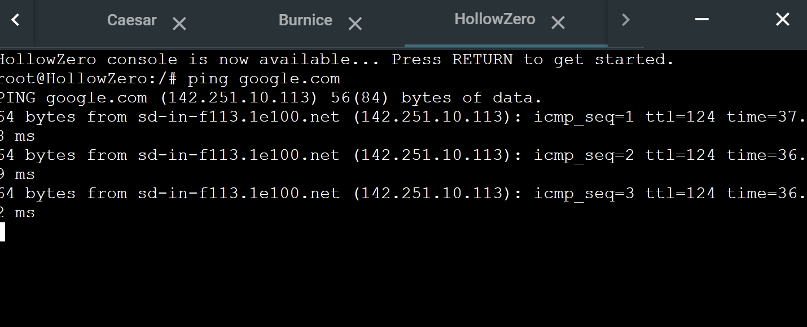
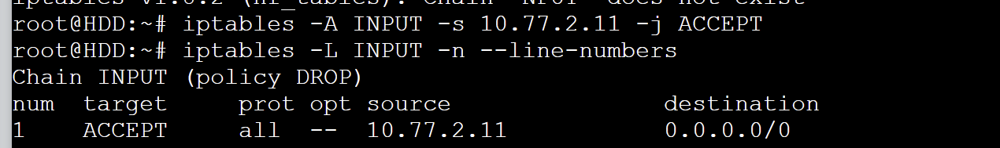
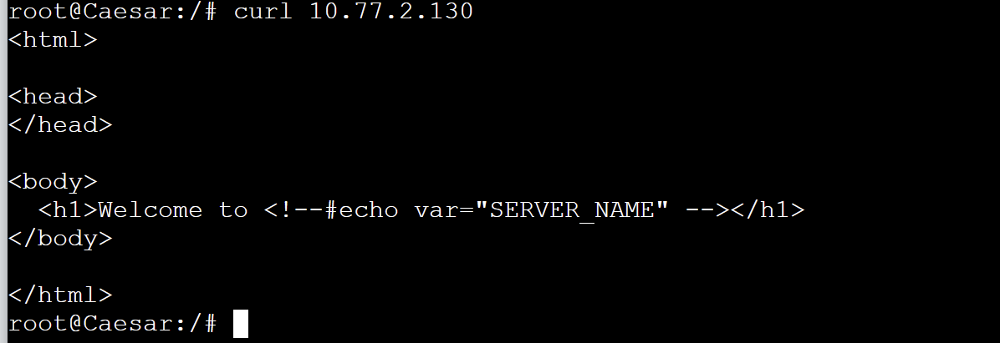

# Jarkom-Modul-5-IT27-2024

## IT 27

| No  | Nama Anggota          | NRP        |
| --- | --------------------- | ---------- |
| 1   | Danendra Fidel Khansa | 5027231063 |
| 2   | Farida Qurrotu A'yuna | 5027231015 |

## IP PREFIX

`10.77`

## MISI 1

## TOPOLOGI GNS | VLSM |


## RUTE SUBNET

| **Nama Subnet** | **Rute**                                      | **Jumlah IP** | **Netmask** |
| --------------- | --------------------------------------------- | ------------- | ----------- |
| A1              | NewEridu > SixStreet                          | 2             | /30         |
| A2              | NewEridu > LuminaSquare                       | 2             | /30         |
| A3              | LuminaSquare > Ofc.Mewmew > HIA > BalletTwins | 3             | /29         |
| A4              | BalletTwins > Victoria > Lycaon > Ellen       | 121           | /25         |
| A5              | LuminaSquare > Pubsec > Policeboo > Jane      | 231           | /24         |
| A6              | SixStreet > Metro1 > ScootOutpost > OuterRing | 3             | /29         |
| A7              | SixStreet > RandomPlay > Fairy > HDD          | 3             | /29         |
| A8              | OuterRing > SoC > Caesar > Burnice            | 56            | /26         |
| A9              | ScootOutpost > HollowZero                     | 2             | /30         |
| **Total**       |                                               | **423**       | **/23**     |

## TREE VLSM


## PEMBAGIAN IP | VLSM |

| Subnet | Jumlah IP | Netmask | Network ID  | Broadcast   | Range IP                  | Subnet Mask     |
| ------ | --------- | ------- | ----------- | ----------- | ------------------------- | --------------- |
| A1     | 2         | /30     | 10.77.0.0   | 10.77.0.3   | 10.77.0.1 - 10.77.0.2     | 255.255.255.252 |
| A2     | 2         | /30     | 10.77.0.4   | 10.77.0.7   | 10.77.0.5 - 10.77.0.6     | 255.255.255.252 |
| A3     | 3         | /29     | 10.77.0.8   | 10.77.0.15  | 10.77.0.9 - 10.77.0.14    | 255.255.255.248 |
| A4     | 121       | /25     | 10.77.0.128 | 10.77.0.255 | 10.77.0.129 - 10.77.0.254 | 255.255.255.128 |
| A5     | 231       | /24     | 10.77.1.0   | 10.77.1.255 | 10.77.1.1 - 10.77.1.254   | 255.255.255.0   |
| A6     | 3         | /29     | 10.77.2.0   | 10.77.2.7   | 10.77.2.1 - 10.77.2.6     | 255.255.255.248 |
| A7     | 3         | /29     | 10.77.2.8   | 10.77.2.15  | 10.77.2.9 - 10.77.2.14    | 255.255.255.248 |
| A8     | 56        | /26     | 10.77.2.64  | 10.77.2.127 | 10.77.2.65 - 10.77.2.126  | 255.255.255.192 |
| A9     | 2         | /30     | 10.77.2.128 | 10.77.2.131 | 10.77.2.129 - 10.77.2.130 | 255.255.255.252 |

## TOPOLOGI SETELAH PEMBAGIAN SUBNET DAN TREE


## KONFIGURASI

### NEW ERIDU (ROUTER)

```
auto eth0
iface eth0 inet dhcp

#A1
auto eth1
iface eth1 inet static
  address 10.77.0.1
  netmask 255.255.255.252

#A2
auto eth2
iface eth2 inet static
  address 10.77.0.5
  netmask 255.255.255.252

#A6
post-up route add -net 10.77.2.0 netmask 255.255.255.248 gw 10.77.0.2

#A3
post-up route add -net 10.77.0.8 netmask 255.255.255.248 gw 10.77.06

#A8
post-up route add -net 10.77.2.64 netmask 255.255.255.192 gw 10.77.0.2

#A7
post-up route add -net 10.77.2.8 netmask 255.255.255.248 gw 10.77.0.2

#A4
post-up route add -net 10.77.0.128 netmask 255.255.255.128 gw 10.77.0.6

#A5
post-up route add -net 10.77.1.0 netmask 255.255.255.0 gw 10.77.0.6

#A9
post-up route add -net 10.77.2.128 netmask 255.255.255.252 gw 10.77.0.2
```

### SixStreet (ROUTER DHCP RELAY)

```
#A1
auto eth0
iface eth0 inet static
  address 10.77.0.2
  netmask 255.255.255.252
  gateway 10.77.0.1

#A6
auto eth1
iface eth1 inet static
  address 10.77.2.1
  netmask 255.255.255.248

#A7
auto eth2
iface eth2 inet static
  address 10.77.2.9
  netmask 255.255.255.248

up echo nameserver 192.168.122.1 > /etc/resolv.conf

#A8
post-up route add -net 10.77.2.64 netmask 255.255.255.192 gw 10.77.2.3

#A9
post-up route add -net 10.77.2.128 netmask 255.255.255.252 gw 10.77.2.2

#A4
post-up route add -net 10.77.0.128 netmask 255.255.255.128 gw 10.77.0.1
```

### LuminaSquare (ROUTER DHCP RELAY)

```
#A2
auto eth0
iface eth0 inet static
  address 10.77.0.6
  netmask 255.255.255.252
  gateway 10.77.0.5

#A3
auto eth1
iface eth1 inet static
  address 10.77.0.9
  netmask 255.255.255.248

#A5
auto eth2
iface eth2 inet static
  address 10.77.1.1
  netmask 255.255.255.0

up echo nameserver 192.168.122.1 > /etc/resolv.conf

#A1
post-up route add -net 10.77.0.0 netmask 255.255.255.252 gw 10.77.0.5

#A4
post-up route add -net 10.77.0.128 netmask 255.255.255.128 gw 10.77.0.11

#A7
post-up route add -net 10.77.2.8 netmask 255.255.255.248 gw 10.77.0.5

```

### BalletTwins (ROUTER DHCP RELAY)

```
#A3
auto eth0
iface eth0 inet static
  address 10.77.0.11
  netmask 255.255.255.248
  gateway 10.77.0.9

#A4
auto eth1
iface eth1 inet static
  address 10.77.0.129
  netmask 255.255.255.128

up echo nameserver 192.168.122.1 > /etc/resolv.conf

#A2
post-up route add -net 10.77.0.4 netmask 255.255.255.252 gw 10.77.0.9

#A1
post-up route add -net 10.77.0.0 netmask 255.255.255.252 gw 10.77.0.9

#A7
post-up  route add -net 10.77.2.8 netmask 255.255.255.248 gw 10.77.0.9
```

### OuterRing (ROUTER DHCP RELAY)

```
#A6
auto eth0
iface eth0 inet static
  address 10.77.2.3
  netmask 255.255.255.248
  gateway 10.77.2.1

#A8
auto eth1
iface eth1 inet static
  address 10.77.2.65
  netmask 255.255.255.192

up echo nameserver 192.168.122.1 > /etc/resolv.conf

#A9
post-up route add -net 10.77.2.128 netmask 255.255.255.252 gw 10.77.2.2

#A1
post-up route add -net 10.77.0.0 netmask 255.255.255.252 gw 10.77.2.1

#A7
post-up route add -net 10.77.2.8 netmask 255.255.255.248 gw 10.77.2.1

```

### ScootOutpost (ROUTER)

```
#A6
auto eth0
iface eth0 inet static
  address 10.77.2.2
  netmask 255.255.255.248
  gateway 10.77.2.1

#A9
auto eth1
iface eth1 inet static
  address 10.77.2.129
  netmask 255.255.255.252

up echo nameserver 192.168.122.1 > /etc/resolv.conf

#A2
post-up route add -net 10.77.0.4 netmask 255.255.255.252 gw 10.77.2.1

#A8
post-up route add -net 10.77.2.16 netmask 255.255.255.192 gw 10.77.2.3

#A1
post-up  route add -net 10.77.0.0 netmask 255.255.255.252 gw 10.77.2.1

```

### Fairy (DHCP SERVER)

```
auto eth0
iface eth0 inet static
  address 10.77.2.11
  netmask 255.255.255.248
  gateway 10.77.2.9

up echo nameserver 192.168.122.1 > /etc/resolv.conf

#A8
post-up route add -net 10.77.2.16 netmask 255.255.255.192 gw 10.77.2.9

#POJOK KANAN BAWAH LYCAON
post-up route add -net 10.77.0.128 netmask 255.255.255.128 gw 10.77.2.9
```

### HDD (DNS SERVER)

```
auto eth0
iface eth0 inet static
  address 10.77.2.10
  netmask 255.255.255.248
  gateway 10.77.2.9

up echo nameserver 192.168.122.1 > /etc/resolv.conf
```

### HollowZero (WEB SERVER)

```
auto eth0
iface eth0 inet static
  address 10.77.2.130
  netmask 255.255.255.252
  gateway 10.77.2.129

up echo nameserver 192.168.122.1 > /etc/resolv.conf

#A1
post-up route add -net 10.77.0.0 netmask 255.255.255.252 gw 10.77.2.129
```

### HIA (WEB SERVER)

```
auto eth0
iface eth0 inet static
  address 10.77.0.10
  netmask 255.255.255.248
  gateway 10.77.0.9

up echo nameserver 192.168.122.1 > /etc/resolv.conf

```

### Caesar (CLIENT)

```
auto eth0
iface eth0 inet dhcp

#Hollowzero
post-up route add -net 10.77.2.64 netmask 255.255.255.252 gw 10.77.2.65

#A1
post-up route add -net 10.77.0.0 netmask 255.255.255.252 gw 10.77.2.65
```

### Burnice (CLIENT)

```
auto eth0
iface eth0 inet dhcp

#Hollowzero
post-up route add -net 10.77.2.128 netmask 255.255.255.252 gw 10.77.2.65
```

### Jane, Policeboo, Ellen, Lycaon (CLIENT)

```
auto eth0
iface eth0 inet dhcp
```

## SETUP

### NewEridu

- `nano setup.sh`

```sh
echo net.ipv4.ip_forward=1 > /etc/sysctl.conf
sysctl -p

ETH0_IP=$(ip -4 addr show eth0 | grep -oP '(?<=inet\s)\d+(\.\d+){3}')
iptables -t nat -A POSTROUTING -o eth0 -j SNAT --to-source $ETH0_IP
```

### HDD (DNS SERVER)

- `nano setup.sh`

```sh
export DEBIAN_FRONTEND=noninteractive
apt update
apt install bind9 netcat -y
cp ~/named.conf.options /etc/bind/named.conf.options

service bind9 restart

#iptables -P INPUT DROP
#iptables -A INPUT -s 10.77.2.11 -j ACCEPT
#NOTES 10.77.2.11 adalah alamat IP dari fairy (DHCP)
```

- `nano named.conf.options`

```conf
options {
        directory "/var/cache/bind";

         forwarders {
                192.168.122.1;
         };

        allow-query { any; };
        auth-nxdomain no;

        listen-on-v6 { any; };
};

```

### Fairy (DHCP SERVER)

- `nano setup.sh`

```sh
export DEBIAN_FRONTEND=noninteractive
apt update
apt install isc-dhcp-server netcat -y
cp ~/dhcpd.conf /etc/dhcp/dhcpd.conf
cp ~/isc-dhcp-server /etc/default/isc-dhcp-server
echo INTERFACESv4=\"eth0\" >/etc/default/isc-dhcp-server
service rsyslog start

service isc-dhcp-server start
#iptables -A INPUT -p icmp --icmp-type echo-request -j DROP //command buat no 2
```

- `nano isc-dhcp-server`

```conf
INTERFACESv4="eth0"
```

- `nano dhcpd.conf`

```conf
#A8
subnet 10.77.2.64 netmask 255.255.255.192 {
  range 10.77.2.66 10.77.2.125;
  option routers 10.77.2.65;
  option broadcast-address 10.77.2.126;
  option domain-name-servers 10.77.2.10;
  default-lease-time 600;
  max-lease-time 7200;
}

#A4
subnet 10.77.0.128 netmask 255.255.255.128 {
  range 10.77.0.130 10.77.0.253;
  option routers 10.77.0.129;
  option broadcast-address 10.77.0.254;
  option domain-name-servers 10.77.2.10;
  default-lease-time 600;
  max-lease-time 7200;
}

#A5
subnet 10.77.1.0 netmask 255.255.255.0 {
  range 10.77.1.2 10.77.1.253;
  option routers 10.77.1.1;
  option broadcast-address 10.77.1.254;
  option domain-name-servers 10.77.2.10;
  default-lease-time 600;
  max-lease-time 7200;
}

#A7
subnet 10.77.2.8 netmask 255.255.255.24 {
}
```

### SixStreet, LuminaSquare, OuterRing, dan BalletTwins (DHCP RELAY)

- `nano setup.sh`

```sh

echo net.ipv4.ip_forward=1 >/etc/sysctl.conf
sysctl -p

export DEBIAN_FRONTEND=noninteractive
apt update
apt install isc-dhcp-relay netcat -y
cp ~/isc-dhcp-relay /etc/default/isc-dhcp-relay

service isc-dhcp-relay start
service rsyslog start
```

- `nano isc-dhcp-relay`

```conf
# Defaults for isc-dhcp-relay initscript
# sourced by /etc/init.d/isc-dhcp-relay
# installed at /etc/default/isc-dhcp-relay by the maintainer scripts

#
# This is a POSIX shell fragment
#

# What servers should the DHCP relay forward requests to?
SERVERS="10.77.2.11"

# On what interfaces should the DHCP relay (dhrelay) serve DHCP requests?
INTERFACES="eth0 eth1 eth2 eth3"

# Additional options that are passed to the DHCP relay daemon?
OPTIONS=""

```

### HollowZero (WebServer)

- `nano setup.sh`

```sh
export DEBIAN_FRONTEND=noninteractive
apt update
apt install apache2 -y
cp ~/index.html /var/www/html/index.html
cp ~/000-default.conf /etc/apache2/sites-available/000-default.conf
service apache2 restart

#iptables -P INPUT DROP
#iptables -A INPUT -s 10.77.0.128/25 -m time --timestart 08:00 --timestop 21:00 -j ACCEPT
#iptables -A INPUT -s 10.77.1.0/24 -m time --timestart 03:00 --timestop 23:00 -j ACCEPT

# Allow only 2 active connections
#iptables -A INPUT -p tcp --dport http -m conntrack --ctstate NEW -m recent --set
#iptables -A INPUT -p tcp --dport http -m conntrack --ctstate NEW -m recent --update --seconds 1 --hitcount 3 -j REJECT
#iptables -A INPUT -p tcp --dport http -j ACCEPT
```

- `nano 000-default.conf`

```conf
<VirtualHost *:80>
    # The ServerName directive sets the request scheme, hostname, and port that
    # the server uses to identify itself. This is used when creating
    # redirection URLs. In the context of virtual hosts, the ServerName
    # specifies what hostname must appear in the request's Host: header to
    # match this virtual host. For the default virtual host (this file) this
    # value is not decisive as it is used as a last resort host regardless.
    # However, you must set it for any further virtual host explicitly.
    # ServerName www.example.com

    ServerAdmin webmaster@localhost
    DocumentRoot /var/www/html

    # Available loglevels: trace8, ..., trace1, debug, info, notice, warn,
    # error, crit, alert, emerg.
    # It is also possible to configure the loglevel for particular
    # modules, e.g.
    # LogLevel info ssl:warn

    ErrorLog ${APACHE_LOG_DIR}/error.log
    CustomLog ${APACHE_LOG_DIR}/access.log combined

    # For most configuration files from conf-available/, which are
    # enabled or disabled at a global level, it is possible to
    # include a line for only one particular virtual host. For example:
    # Include conf-available/serve-cgi-bin.conf
</VirtualHost>

# vim: syntax=apache ts=4 sw=4 sts=4 sr noet

```

- `nano index.html`

```html
<html>
  <head> </head>

  <body>
    <h1>
      Welcome to
      <!--#echo var="SERVER NAME" -->
    </h1>
  </body>
</html>
```

### HIA (WebServer)

- `nano setup.sh`

```sh
export DEBIAN_FRONTEND=noninteractive
apt update
apt install apache2 -y
cp ~/index.html /var/www/html/index.html
cp ~/000-default.conf /etc/apache2/sites-available/000-default.conf
service apache2 restart

#iptables -P INPUT DROP
#iptables -A INPUT -s 10.77.0.128/25 -m time --timestart 08:00 --timestop 21:00 -j ACCEPT
#iptables -A INPUT -s 10.77.1.0/24 -m time --timestart 03:00 --timestop 23:00 -j ACCEPT

#Create a chain for handling port scanning
#iptables -N PORTSCAN

#Detect and handle new connections to ports 1-100
#iptables -I INPUT 1 -j LOG --log-prefix "PORT SCAN BRO: " --log-level 4 --log-tcp-options --log-ip-options
#iptables -A INPUT -p tcp --dport 1:100 -m state --state NEW -m recent --set --name portscan
#iptables -A INPUT -p tcp --dport 1:100 -m state --state NEW -m recent --update --seconds 10 --hitcount 25 --name portscan -j PORTSCAN

#Log and block port-scanning IPs
#iptables -A PORTSCAN -m recent --set --name blacklist
#iptables -I PORTSCAN 1 -j LOG --log-prefix "PORT SCAN DETECTED: " --log-level 4 --log-tcp-options --log-ip-options
#iptables -A PORTSCAN -j DROP

#Block all further traffic from blacklisted IPs
#iptables -A INPUT -m recent --name blacklist --rcheck -j DROP
#iptables -A OUTPUT -m recent --name blacklist --rcheck -j DROP
```

- `nano 000-default.conf`

```conf
<VirtualHost *:80>
    # The ServerName directive sets the request scheme, hostname, and port that
    # the server uses to identify itself. This is used when creating
    # redirection URLs. In the context of virtual hosts, the ServerName
    # specifies what hostname must appear in the request's Host: header to
    # match this virtual host. For the default virtual host (this file) this
    # value is not decisive as it is used as a last resort host regardless.
    # However, you must set it for any further virtual host explicitly.
    # ServerName www.example.com

    ServerAdmin webmaster@localhost
    DocumentRoot /var/www/html

    # Available loglevels: trace8, ..., trace1, debug, info, notice, warn,
    # error, crit, alert, emerg.
    # It is also possible to configure the loglevel for particular
    # modules, e.g.
    # LogLevel info ssl:warn

    ErrorLog ${APACHE_LOG_DIR}/error.log
    CustomLog ${APACHE_LOG_DIR}/access.log combined

    # For most configuration files from conf-available/, which are
    # enabled or disabled at a global level, it is possible to
    # include a line for only one particular virtual host. For example:
    # Include conf-available/serve-cgi-bin.conf
</VirtualHost>

# vim: syntax=apache ts=4 sw=4 sts=4 sr noet

```

- `nano index.html`

```html
<html>
  <head> </head>

  <body>
    <h1>
      Welcome to
      <!--#echo var="SERVER NAME" -->
    </h1>
  </body>
</html>
```

## PERSIAPAN

- Pertama jalankan `bash setup.sh` pada NewEridu

  

- Kemudian jalankan `bash setup.sh` pada DHCP SERVER (FAIRY)

  

- Setelah itu jalankan `bash setup.sh` semua DHCP RELAY

  

  

- Kemudian nyalakan node client dan DHCP berhasil

  

  

## MISI 2

### 1. Agar jaringan di New Eridu bisa terhubung ke luar (internet), kalian perlu mengkonfigurasi routing menggunakan iptables. Namun, kalian tidak diperbolehkan menggunakan MASQUERADE

- Pada Konfigurasi New Eridu Tambahkan

```
ETH0_IP=$(ip -4 addr show eth0 | grep -oP '(?<=inet\s)\d+(\.\d+){3}')
iptables -t nat -A POSTROUTING -o eth0 -j SNAT --to-source $ETH0_IP
```

- Lalu nyalakan node dan coba `ping google.com` di node bebas (misal di HollowZero)

  

### 2. Karena Fairy adalah Al yang sangat berharga, kalian perlu memastikan bahwa tidak ada perangkat lain yang bisa melakukan ping ke Fairy. Tapi Fairy tetap dapat mengakses seluruh perangkat.

- `cat setup.sh` pada DHCP SERVER (FAIRY) Kemudian copy yang dicommand

  

- Kemudian cek dengan `iptables -L INPUT -n --line-numbers

  

- Setelah itu jalankan `iptables -A INPUT -p icmp --icmp-type echo-request -j DROP` dan cek ulang degan `iptables -L INPUT -n --line-numbers`

  

- Kemudian coba ping 2 arah dari DHCP SERVER (FAIRY) dan 1nya node bebas

  - Dari Fairy ke luar
    

  - Dari Luar Ke FairyS
    

### 3. Selain itu, agar kejadian sebelumnya tidak terulang, hanya Fairy yang dapat mengakses HDD. Gunakan nc (netcat) untuk memastikan akses ini. [hapus aturan iptables setelah pengujian selesai agar internet tetap dapat diakses.

- Ke DNS SERVER (HDD) terus `bash setup.sh`

  

- Lalu `cat setup.sh` terus cek yang dicommand

  

- Lalu cek dengan `iptables -L INPUT -n --line-numbers`

  

- Kemudian buat aturan untuk blok semua request `iptables -P INPUT DROP` kalo ada ipnya sebelumnya terus cek lagi `iptables -L INPUT -n --line-numbers`

  

- Setelah itu buat aturan agar hanya FAIRY (10.77.2.11) yang bisa akses

  

- Test ping

  - FAIRY ke HDD
    

  - Node lain ke HDD
    

- Test NetCat

  - FAIRY ke HDD
    

    

  - Node lain ke HDD
    

    

### 4. Fairy mendeteksi aktivitas mencurigakan di server Hollow. Namun, berdasarkan peraturan polisi New Eridu, Hollow hanya boleh diakses pada hari Senin hingga Jumat dan hanya oleh faksi SoC (Burnice & Caesar) dan PubSec (Jane & Policeboo). Karena hari ini hari Sabtu, mereka harus menunggu hingga hari Senin. Gunakan curl untuk memastikan akses ini.

- Pada HOLLOWZERO (WebServer) `bash setup.sh`

  

- Cek Website dengan `curl localhost`

  

- lalu `cat setup.sh` cek yang di command 3 teratas

  

- Kemudian `date` untuk senin-jumat buat liat tanggal sekarang, lalu jalanin 3 command iptables dibawah

  

- Coba ping di salah 1 client

  

- Kemudian ganti aturan agar sabtu bisa diakses, drop yang 10.77.2.64, lalu `iptables -D INPUT 2 iptables -A INPUT -s 10.77.2.64/26 -m time --weekdays Sat -j ACCEPT` allow buat hari sabtu

  

- Lalu test `ping 10.77.2.130` dan `curl 10.77.2.130` di client

  

  

### 5. Sembari menunggu, Fairy menyarankan Phaethon untuk berlatih di server HIA dan meminta bantuan dari faksi Victoria (Ellen & Lycaon) dan PubSec. Akses HIA hanya diperbolehkan untuk

a. Ellen dan Lycaon pada jam 08.00-21.00.

b. Jane dan Policeboo pada jam 03.00-23.00. (hak kepolisian)

Gunakan Curl untuk memastikan akses ini.

- Pertama `bash setup.sh` di HIA (WebServer)

  

- Kemudian `curl localhost`

  

- Lalu `cat setup.sh` untuk melihat 3 yang di command

  

- Masukkan command beriku di terminal `iptables -P INPUT DROP`, kemudian `iptables -A INPUT -s 10.77.0.128/25 -m time --timestart 08:00 --timestop 21:00 -j ACCEPT`, dan terkahir `iptables -A INPUT -s 10.77.1.0/24 -m time --timestart 03:00 --timestop 23:00 -j ACCEPT` sesuai yang diminta soal

  

- Kemudian coba test `curl 10.77.0.10`

  - Pada client Policeboo
    

  - Pada client Lycaon
    
