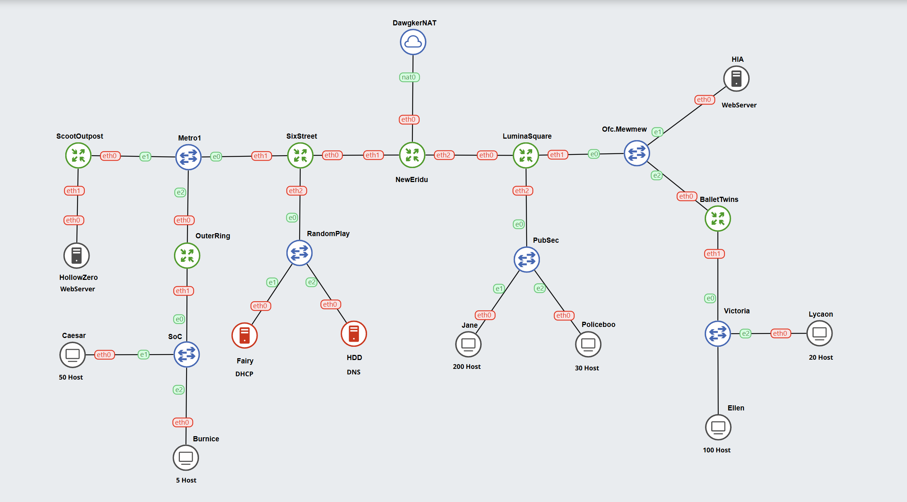

# Jarkom-Modul-5-IT27-2024

## IT 27

| No  | Nama Anggota          | NRP        |
| --- | --------------------- | ---------- |
| 1   | Danendra Fidel Khansa | 5027231063 |
| 2   | Farida Qurrotu A'yuna | 5027231015 |

## IP PREFIX

`10.77`

## TOPOLOGI GNS | VLSM |

## RUTE SUBNET

| **Nama Subnet** | **Rute**                                      | **Jumlah IP** | **Netmask** |
| --------------- | --------------------------------------------- | ------------- | ----------- |
| A1              | NewEridu > SixStreet                          | 2             | /30         |
| A2              | NewEridu > LuminaSquare                       | 2             | /30         |
| A3              | LuminaSquare > Ofc.Mewmew > HIA > BalletTwins | 3             | /29         |
| A4              | BalletTwins > Victoria > Lycaon > Ellen       | 121           | /25         |
| A5              | LuminaSquare > Pubsec > Policeboo > Jane      | 231           | /24         |
| A6              | SixStreet > Metro1 > ScootOutpost > OuterRing | 3             | /29         |
| A7              | SixStreet > RandomPlay > Fairy > HDD          | 3             | /29         |
| A8              | OuterRing > SoC > Caesar > Burnice            | 56            | /26         |
| A9              | ScootOutpost > HollowZero                     | 2             | /30         |
| **Total**       |                                               | **423**       | **/23**     |

## TREE VLSM

## PEMBAGIAN IP | VLSM |

| **Subnet** | **Jumlah IP** | **Netmask** | **Network ID** | **Broadcast** | **Range IP**              |
| ---------- | ------------- | ----------- | -------------- | ------------- | ------------------------- |
| A1         | 2             | /30         | 10.72.0.0      | 10.72.0.3     | 10.72.0.1 - 10.72.0.2     |
| A2         | 2             | /30         | 10.72.0.4      | 10.72.0.7     | 10.72.0.5 - 10.72.0.6     |
| A3         | 3             | /29         | 10.72.0.8      | 10.72.0.15    | 10.72.0.9 - 10.72.0.14    |
| A4         | 121           | /25         | 10.72.0.16     | 10.72.0.143   | 10.72.0.17 - 10.72.0.142  |
| A5         | 231           | /24         | 10.72.0.144    | 10.72.1.143   | 10.72.0.145 - 10.72.1.142 |
| A6         | 3             | /29         | 10.72.1.144    | 10.72.1.151   | 10.72.1.145 - 10.72.1.150 |
| A7         | 3             | /29         | 10.72.1.152    | 10.72.1.159   | 10.72.1.153 - 10.72.1.158 |
| A8         | 56            | /26         | 10.72.1.160    | 10.72.1.223   | 10.72.1.161 - 10.72.1.222 |
| A9         | 2             | /30         | 10.72.1.224    | 10.72.1.227   | 10.72.1.225 - 10.72.1.226 |

## TOPOLOGI SETELAH PEMBAGIAN SUBNET DAN TREE

